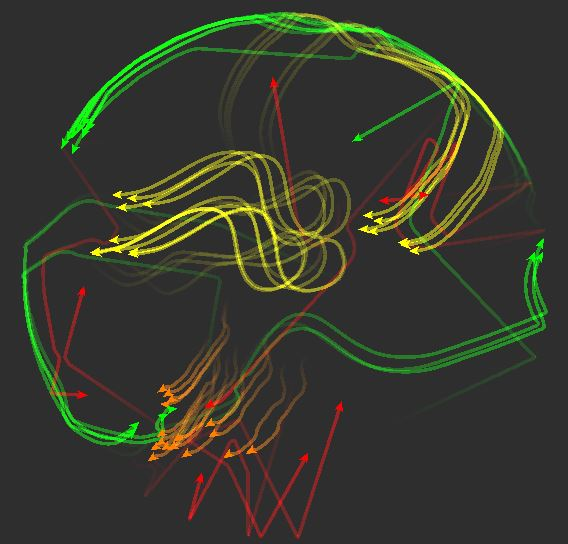

<p align="center"><a href="https://www.codechefvit.com" target="_blank"></a>
</p>

<h2 align="center"> &nbsp;&nbsp;Boids Simulation </h2>
<br/>

> Boids Simulation is a visualisation tool made in Unity/C#. It is an attempt to artificially simulate movement of birds/fish in flocks

---

## Features
- Customisable behaviors
- 4 different species to simulate a vast variety of behaviors

## Screenshots
<p align="center">

</p>
<p align="center">

</p>


## Dependencies
 - Unity 2019.4.16f1
## Instructions

#### Directions to Install
```sh
$ git clone https://github.com/AngadBasandrai/boids-simulation.git
```
#### Directions to Run
- Open Unity Hub
- Click Open Project
- Go to the directory of the project and click open
## Contributors
<table>
	<tr align="center" style="font-weight:bold">
		<td>
		Angad Basandrai
		<p align="center">
			
		</p>
			<p align="center">
				<a href = "https://github.com/AngadBasandrai">
					
				</a>
			</p>
		</td>
				<td>
		Arjun Basandrai
		<p align="center">
			
		</p>
			<p align="center">
				<a href = "https://github.com/ArjunBasandrai">
					
				</a>
			</p>
		</td>
	</tr>
</table>

## License
<a href = "https://www.gnu.org/licenses/gpl-3.0.en.html#license-text">
  
</a>

<p align="center">
	Made with :heart: by <a href="https://github.com/AngadBasandrai" target="_blank">Angad Basandrai</a>
</p>
